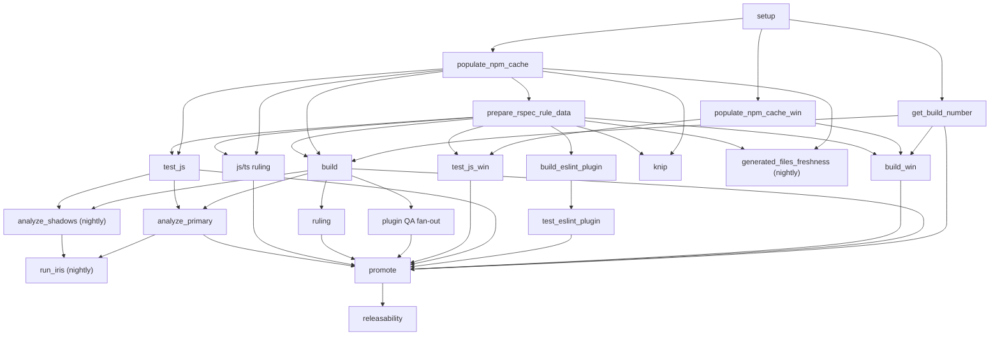
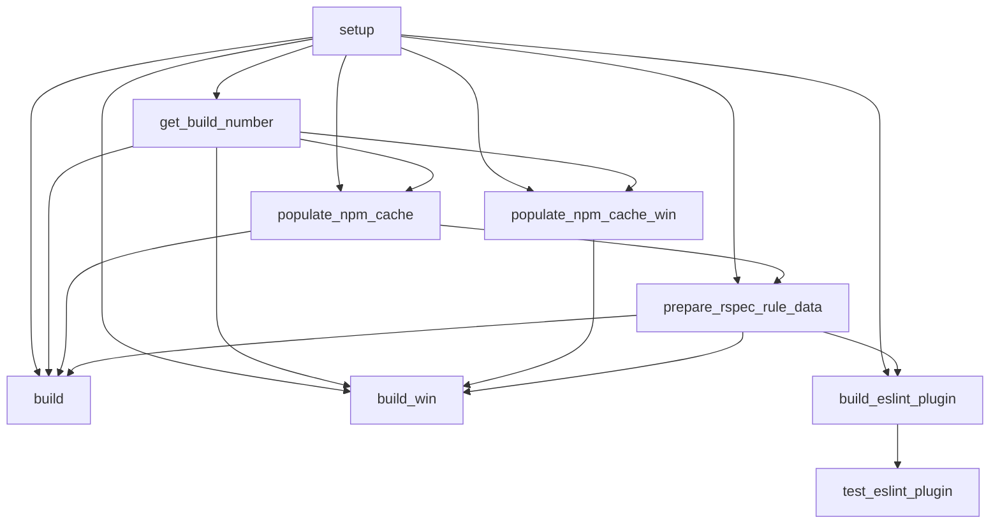
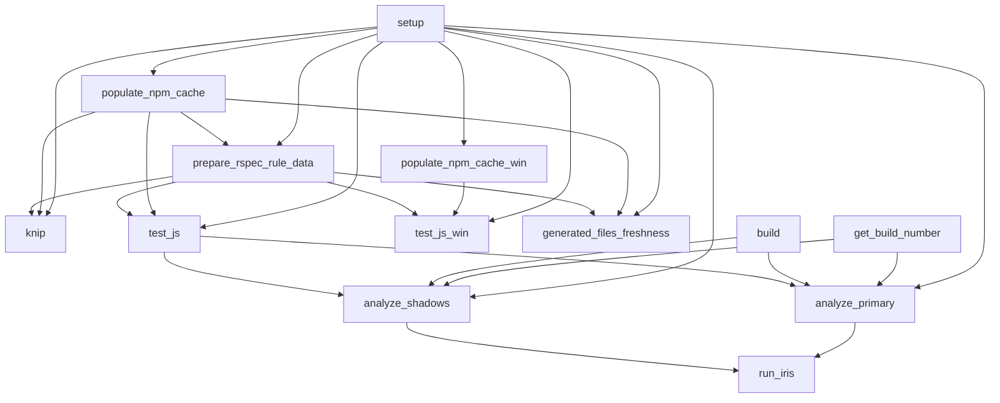
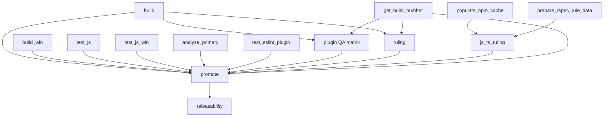

# SonarJS CI Reference

This document explains the main GitHub Actions pipeline in
[`../.github/workflows/build.yml`](../.github/workflows/build.yml).

It documents the cache/artifact model used by the workflow:

- direct workflow-level cache usage in `build.yml` uses official GitHub cache actions
- same-run file handoff uses official GitHub artifact actions
- local cache wrappers (`maven-cache`, `orchestrator-cache`, `rule-api-cache`) also use official GitHub cache actions
- `build.yml` uses explicit npm registry configuration on both Linux and Windows cache-population jobs
- `build.yml` does not use SonarSource's S3-backed cache action

This is the document to read first when you need to answer any of these questions quickly:

- Which jobs exist and why?
- Which jobs depend on which other jobs?
- What data moves via outputs, caches, and artifacts?
- What is shared across jobs in one run?
- What is shared from the default branch to other branches?
- Where does S3 still appear, and where does it not?
- How do Repox, Vault, RSPEC, SonarQube, and promotion fit into the pipeline?

## Scope

This document focuses on the main `Build` workflow:

- [`../.github/workflows/build.yml`](../.github/workflows/build.yml)
- [`../.github/actions/maven-cache/action.yml`](../.github/actions/maven-cache/action.yml)
- [`../.github/actions/orchestrator-cache/action.yml`](../.github/actions/orchestrator-cache/action.yml)
- [`../.github/actions/rule-api-cache/action.yml`](../.github/actions/rule-api-cache/action.yml)

Other workflows exist in `.github/workflows/`, but they are out of scope unless they directly affect the `build.yml` lifecycle.

## Cache And Artifact Model

The workflow uses a deliberate split between GitHub cache and GitHub artifacts:

- `node_modules`, Maven, orchestrator, rule-api, JS coverage, and the Windows JS marker use cache semantics
- RSPEC data, built Maven outputs, JaCoCo reports, JS coverage reports, and the ESLint plugin tarball use artifact semantics
- `prepare_rspec_rule_data` refreshes RSPEC once and shares the result through a per-run artifact
- Maven, orchestrator, and rule-api cache policy is centralized in local wrapper actions
- `config-maven` configures Maven and Repox access, but its built-in caching is disabled in `build.yml`
- NPM registry authentication is configured explicitly in `build.yml` through Vault-fetched Artifactory tokens
- all direct workflow cache steps and the local cache wrappers use the same official GitHub cache actions

## Trigger Model And Global Controls

`build.yml` runs on:

- `push` to `master`
- `push` to `branch-*`
- `push` to `dogfood-*`
- `pull_request`
- `merge_group`
- `workflow_dispatch`
- nightly `schedule`

Global behavior:

- `concurrency.group = ${{ github.workflow }}-${{ github.event.pull_request.number || github.ref }}`
- `cancel-in-progress: true`

That means:

- one PR gets at most one active `Build` run
- one branch ref gets at most one active `Build` run
- new pushes cancel older in-flight runs for the same PR/ref

## Runner Strategy

Runner labels express relative size and environment, not a stable hardware contract. The workflow uses them as follows:

| Runner label | Typical jobs | Why it is used |
| --- | --- | --- |
| `sonar-xs` | `setup`, `get_build_number`, `populate_npm_cache`, `prepare_rspec_rule_data`, `knip`, `promote`, `releasability`, `run_iris` | Lightweight orchestration, metadata, cache preparation, and control-plane jobs |
| `sonar-m` | `test_js`, `analyze_primary`, `analyze_shadows`, most Linux plugin QA jobs | Medium Linux compute for tests and analysis |
| `sonar-l` | `build` | Main Linux Maven build and deploy |
| `sonar-xl` | `js_ts_ruling`, `ruling` | Large ruling workloads |
| `github-ubuntu-latest-s` | `build_eslint_plugin`, `test_eslint_plugin`, `generated_files_freshness` | Small GitHub-hosted Linux jobs |
| `github-windows-latest-s` | `populate_npm_cache_win` | Small Windows cache producer |
| `github-windows-latest-m` | `build_win`, `test_js_win`, Windows plugin QA jobs | Medium Windows build/test jobs |
| `warp-custom-ubuntu-24-04` + Alpine container | Alpine QA jobs | Host runner plus containerized musl/Alpine validation |

## High-Level Pipeline Map



## Detailed Dependency Views

The full 31-job dependency graph is too dense to read well as a single Mermaid diagram. The grouped views below are the readable version; the job table that follows is the exact exhaustive reference.

### 1. Setup And Artifact Producers



### 2. Verification And Analysis



### 3. QA, Ruling, And Release Fan-In



## Job Index

| Job | Runner | Needs | Condition |
| --- | --- | --- | --- |
| `setup` | `sonar-xs` | `-` | default |
| `get_build_number` | `sonar-xs` | `setup` | non-fork PRs and all non-PR runs |
| `populate_npm_cache` | `sonar-xs` | `setup`, `get_build_number` | non-fork PRs and all non-PR runs |
| `populate_npm_cache_win` | `github-windows-latest-s` | `setup`, `get_build_number` | non-fork PRs and all non-PR runs |
| `prepare_rspec_rule_data` | `sonar-xs` | `setup`, `populate_npm_cache` | non-fork PRs and all non-PR runs |
| `build` | `sonar-l` | `setup`, `get_build_number`, `populate_npm_cache`, `prepare_rspec_rule_data` | non-fork PRs and all non-PR runs |
| `build_win` | `github-windows-latest-m` | `setup`, `get_build_number`, `populate_npm_cache_win`, `prepare_rspec_rule_data` | non-fork PRs and all non-PR runs |
| `build_eslint_plugin` | `github-ubuntu-latest-s` | `setup`, `prepare_rspec_rule_data` | non-fork PRs and all non-PR runs |
| `generated_files_freshness` | `github-ubuntu-latest-s` | `setup`, `populate_npm_cache`, `prepare_rspec_rule_data` | nightly only |
| `test_eslint_plugin` | `github-ubuntu-latest-s` | `setup`, `build_eslint_plugin` | default |
| `knip` | `sonar-xs` | `setup`, `populate_npm_cache`, `prepare_rspec_rule_data` | default |
| `test_js` | `sonar-m` | `setup`, `populate_npm_cache`, `prepare_rspec_rule_data` | default |
| `test_js_win` | `github-windows-latest-m` | `setup`, `populate_npm_cache_win`, `prepare_rspec_rule_data` | default |
| `analyze_primary` | `sonar-m` | `setup`, `get_build_number`, `test_js`, `build` | non-fork PRs and all non-PR runs |
| `analyze_shadows` | `sonar-m` | `setup`, `get_build_number`, `test_js`, `build` | nightly only |
| `plugin_qa_with_node` | `sonar-m` | `setup`, `get_build_number`, `build` | non-fork PRs and all non-PR runs |
| `plugin_qa_fast_with_node` | `sonar-m` | `setup`, `get_build_number`, `build` | non-fork PRs and all non-PR runs |
| `plugin_qa_without_node` | `sonar-m` | `setup`, `get_build_number`, `build` | non-fork PRs and all non-PR runs |
| `plugin_qa_without_node_dev` | `sonar-m` | `setup`, `get_build_number`, `build` | nightly only |
| `plugin_qa_without_node_alpine` | `warp-custom-ubuntu-24-04` | `setup`, `get_build_number`, `build` | nightly only |
| `plugin_qa_fast_without_node` | `sonar-m` | `setup`, `get_build_number`, `build` | non-fork PRs and all non-PR runs |
| `plugin_qa_fast_without_node_dev` | `sonar-m` | `setup`, `get_build_number`, `build` | nightly only |
| `plugin_qa_fast_without_node_alpine` | `warp-custom-ubuntu-24-04` | `setup`, `get_build_number`, `build` | nightly only |
| `plugin_qa_win` | `github-windows-latest-m` | `setup`, `get_build_number`, `build` | non-fork PRs and all non-PR runs |
| `plugin_qa_sonarlint_win` | `github-windows-latest-m` | `setup`, `get_build_number`, `build` | non-fork PRs and all non-PR runs |
| `plugin_qa_win_fast_with_node` | `github-windows-latest-m` | `setup`, `get_build_number`, `build` | non-fork PRs and all non-PR runs |
| `js_ts_ruling` | `sonar-xl` | `setup`, `populate_npm_cache`, `prepare_rspec_rule_data` | non-fork PRs and all non-PR runs |
| `ruling` | `sonar-xl` | `setup`, `get_build_number`, `build` | non-fork PRs and all non-PR runs |
| `run_iris` | `sonar-xs` | `analyze_primary`, `analyze_shadows` | nightly only |
| `promote` | `sonar-xs` | many fan-in jobs | only when upstream jobs succeeded and the run is allowed to promote |
| `releasability` | `sonar-xs` | `promote` | only after successful promote on `master`, `branch-*`, or `dogfood-*` |

## Control-Plane Handoff

These are the small data items passed as job outputs or step outputs, not bulky file payloads.

| Producer | Data | Consumers | Meaning |
| --- | --- | --- | --- |
| `setup` | `node-matrix` | Node-matrix plugin QA jobs | Derived from `package.json` engine range |
| `setup` | `js-files-hash` | `test_js`, `test_js_win` | Cache key seed for JS coverage and Windows JS marker |
| `setup` | `maven-hash` | all `maven-cache` users | Cache key seed for Maven dependencies |
| `setup` | `npm-hash` | all `node_modules` producers/consumers | Exact cache key seed for installed Node dependencies |
| `setup` | `cache-month` | `maven-cache` | Monthly key rotation value |
| `setup` | `is-default-branch` | most `mise-action` calls | Controls when tool caches may be saved |
| `get_build_number` | `build-number` | build, QA, analysis, promotion, and shared env anchor users | One build number is minted once and reused consistently |
| `config-maven` | `project-version` | `analyze_primary`, `analyze_shadows` | Sonar analysis version value |

### Important internal detail: build number cache

`SonarSource/ci-github-actions/get-build-number` itself uses GitHub cache internally:

- restore: `build-number-${github.run_id}`
- save: same key
- purpose: rerun stability within one workflow run

That cache is tiny, but it is still part of the repository's GitHub cache footprint.

## File-Plane Handoff Inside One Workflow Run

Artifacts are the only cross-job file handoff mechanism that is guaranteed to stay inside one workflow run. They do not flow from `master` to branches or from one run to the next.

### Artifacts

| Producer | Artifact name | Consumers | Purpose | Retention |
| --- | --- | --- | --- | --- |
| `prepare_rspec_rule_data` | `rspec-rule-data-${github.sha}` | `build`, `build_win`, `build_eslint_plugin`, `generated_files_freshness`, `knip`, `test_js`, `test_js_win`, `js_ts_ruling` | One RSPEC refresh per run; downstream jobs do not refresh again | 1 day |
| `build` | `sonarjs-m2` | all plugin QA jobs, `ruling` | Share locally built SonarJS Maven artifacts instead of rebuilding them everywhere | 1 day |
| `build` | `maven-targets-${github.sha}` | `analyze_primary`, `analyze_shadows` | Reuse compiled Maven outputs for Sonar analysis | 1 day |
| `build` | `jacoco-xml-reports-${github.sha}` | `analyze_primary`, `analyze_shadows` | Reuse JaCoCo XML coverage reports | 1 day |
| `build_eslint_plugin` | `eslint-tarball-${github.sha}` | `test_eslint_plugin` | Same-run ESLint plugin tarball handoff | 1 day |
| `test_js` | `js-coverage-reports-${github.sha}` | `analyze_primary`, `analyze_shadows` | Reuse JS coverage reports for Sonar analysis | 1 day |
| `ruling` | `ruling-differences` | humans only on failure | Failure triage artifact | default retention for upload step |

### Why ESLint Tarball Is An Artifact, Not A Cache

The ESLint plugin tarball is purely same-run handoff:

- producer: `build_eslint_plugin`
- consumer: `test_eslint_plugin`
- no reuse across workflow runs is needed
- stale cross-run reuse would be actively misleading

That is exactly artifact semantics, not cache semantics.

## Cross-Run State: Caches

### Explicit workflow-owned caches

| Cache | Path | Producer(s) | Consumer(s) | Key shape | Save policy |
| --- | --- | --- | --- | --- | --- |
| installed NPM dependencies | `node_modules` | `populate_npm_cache`, `populate_npm_cache_win` | `build`, `build_win`, `prepare_rspec_rule_data`, `build_eslint_plugin`, `generated_files_freshness`, `knip`, `test_js`, `test_js_win`, `analyze_primary`, `analyze_shadows`, `js_ts_ruling` | `npm-${runner.os}-${npm-hash}` | producer jobs use `actions/cache` with `lookup-only: true`; save happens only after a miss and a successful install |
| JS coverage cache | `coverage/js` | `test_js` | `test_js` itself | `js-coverage-${js-files-hash}` | combined restore/save cache; allows skip when exact coverage already exists |
| Windows JS marker | `.js-test-marker-win` | `test_js_win` | `test_js_win` itself | `js-test-win-${js-files-hash}` | lookup-only probe; on miss the job runs tests and saves marker at job end |
| Maven repository | `~/.m2/repository` | default-branch runs through `maven-cache` | all `maven-cache` users | `maven-${runner.os}-${cache-month}-${maven-hash}` plus monthly restore prefix | only default branch saves; non-default branches restore only |
| Orchestrator home | `${github.workspace}/orchestrator` | default-branch QA jobs through `orchestrator-cache` | orchestrator-based QA/ruling jobs | `${key-prefix}-${month}-${github.run_id}` with monthly restore prefix | only default branch saves unless `save: false` |
| Rule API clone/cache | `$HOME/.sonar/rule-api` | default-branch `prepare_rspec_rule_data` through `rule-api-cache` | `prepare_rspec_rule_data` | `${key-prefix}-${github.run_id}` with prefix restore | only default branch saves unless `save: false` |

### Helper-owned or transitive caches

| Owner | Path or payload | Backend | Why it exists |
| --- | --- | --- | --- |
| `get-build-number` action | `.build_number.txt` | GitHub cache | Reuse one build number across reruns of the same workflow run |
| `jdx/mise-action` | tool/runtime downloads | action-managed cache behavior | Reuses provisioned Java/Maven/Node toolchains; not a SonarJS-specific cache contract |

### Local wrapper semantics

#### Maven cache wrapper

`maven-cache` is the repo's opinionated wrapper around official GitHub cache primitives:

- branches: `actions/cache/restore` only
- default branch: full `actions/cache`
- keys rotate monthly and also hash all `pom.xml` files
- restore key allows reuse of other Maven entries from the same month when the exact key misses
- after restore, the wrapper deletes `~/.m2/repository/org/sonarsource/javascript`

That last cleanup is important:

- branch jobs may restore Maven dependencies from cache
- but they must not accidentally consume a stale locally built SonarJS artifact from cache
- SonarJS artifacts are instead handed over explicitly via the `sonarjs-m2` artifact

#### Orchestrator cache wrapper

`orchestrator-cache` is intentionally more rolling and less content-addressed:

- key includes `github.run_id`
- restore uses a prefix within the current month
- only default branch saves
- `key-prefix` separates normal and `fast` orchestrator environments
- `save: 'false'` forces restore-only even on default branch

This matches orchestrator state better than a content hash would:

- the workload depends on runtime images and evolving infrastructure state
- exact content identity is less important than getting a recent warm baseline

#### Rule API cache wrapper

`rule-api-cache` behaves like a rolling GitHub cache:

- key includes `github.run_id`
- restore uses a stable prefix
- only default branch saves unless disabled

This is deliberate because the underlying RSPEC clone/cache evolves independently of the SonarJS tree. A pure repository hash would be a poor invalidation signal here.

## Branch, PR, And Default-Branch Data Flow

### 1. Same workflow run

Use artifacts.

- `prepare_rspec_rule_data` produces RSPEC files once
- `build` produces Maven outputs and coverage reports once
- `build_eslint_plugin` produces one tarball
- downstream jobs download exactly those outputs from the same run

Artifacts never become the default-branch warm source for future runs.

### 2. Default branch to non-default branches

Use caches.

#### `node_modules`

The `node_modules` design is strict:

- exact key only
- no restore keys
- Linux and Windows keys are separated by `runner.os`

Implications:

- if the default branch has already populated `npm-${runner.os}-${npm-hash}`, a branch/PR run can restore that exact cache
- if the default branch does not have that exact cache yet, producer jobs do a real install and then save at job end
- consumer jobs fail on a cache miss; they assume the producer job already handled population

The producer pattern matters:

- `actions/cache` with `lookup-only: true` checks existence without downloading content
- on hit: skip checkout/tool setup/install
- on miss: do the install
- because the step is `actions/cache`, not `actions/cache/restore`, the post step still saves the populated cache after success

#### Maven / orchestrator / rule-api

The repo explicitly centralizes branch behavior:

- non-default branches restore only
- default branch is the intended producer of warm caches
- restore keys allow branches to reuse recent default-branch entries
- branches do not write their own long-lived copies of those caches

This makes `master` the canonical source of warm cross-branch state for those caches.

### 3. Branch or PR back to default branch

There is effectively no promotion of branch-produced file payloads back to the default branch:

- artifacts are run-local only
- branch caches do not become the default-branch cache
- restore-only wrappers make that explicit for Maven/orchestrator/rule-api
- default branch stays the authoritative producer for shared long-lived cache state

### 4. PR-specific state

PR runs still create PR-scoped GitHub state:

- build-number caches
- `node_modules` caches when the exact key is missing
- JS coverage cache
- Windows JS marker cache
- action-owned caches such as `mise`
- workflow artifacts for that PR's runs

That is why the repository also defines a PR-close cleanup workflow.

## S3 In This Workflow

`build.yml` does not use SonarSource's S3-backed cache action.

For this workflow, the relevant storage primitives are:

- GitHub cache for cross-run reusable state
- GitHub artifacts for same-run file payloads

S3 may still exist elsewhere in SonarSource reusable actions or in other workflows, but it is not part of the `build.yml` data path described in this document.

## Why GitHub Cache / Artifact Makes Sense Here

### Good fits for official GitHub primitives

| Payload | Best primitive | Why |
| --- | --- | --- |
| `node_modules` | GitHub cache | exact-key reusable install output; natural cross-run cache |
| JS coverage skip output | GitHub cache | cache key is tied to source hash; restore/save in same job |
| Windows JS test marker | GitHub cache | tiny skip marker, not a reusable artifact |
| RSPEC prepared files | artifact | per-run output shared by many downstream jobs |
| ESLint tarball | artifact | one producer, one consumer, same run only |
| Maven build outputs for analysis | artifact | exact same run-local compiled outputs are required |
| locally built SonarJS Maven artifacts | artifact | explicit handoff is safer than accidentally restoring stale cached builds |

### Why not use one cache mechanism for everything?

Because the semantics differ:

- caches are for future reuse across runs
- artifacts are for deterministic handoff inside the current run
- pretending a run-local artifact is a cache invites stale reuse
- pretending a reusable dependency directory is an artifact creates needless uploads and downloads on every run

## Job-By-Job Walkthrough

### Foundation and dependency preparation

#### `setup`

Responsibilities:

- derive Node matrix from `package.json`
- hash JavaScript sources for JS test reuse
- hash Maven files for Maven cache
- hash lockfile plus patches for `node_modules` cache
- compute cache month
- expose whether this is the default branch

This job is the control-plane root of the workflow.

#### `get_build_number`

Responsibilities:

- mint or recover a single build number
- make that value available to later jobs

This prevents downstream jobs from inventing inconsistent build numbers.

#### `populate_npm_cache` / `populate_npm_cache_win`

Responsibilities:

- probe the exact `node_modules` cache
- if present, stop early
- if missing, install dependencies and let the post step save the cache

Platform specifics:

- both jobs fetch an Artifactory access token from Vault
- both jobs configure the npm registry explicitly with `npm config set`
- Linux and Windows still produce separate `node_modules` caches because the cache key includes `runner.os`

#### `prepare_rspec_rule_data`

Responsibilities:

- restore `node_modules`
- restore Maven cache
- restore rule-api cache
- authenticate to RSPEC through Vault-fetched GitHub token
- run `npm run rspec:refresh`
- upload refreshed rule JSON and `rspec.sha` files as an artifact

This is the only job in the pipeline that refreshes RSPEC.

### Core build and correctness jobs

#### `build`

Responsibilities:

- restore `node_modules`
- restore Maven cache
- download refreshed RSPEC files
- configure Maven/Repox
- fetch deploy/signing credentials
- run Maven deploy with coverage/sign/release profiles
- upload:
  - `sonarjs-m2`
  - `maven-targets-${github.sha}`
  - `jacoco-xml-reports-${github.sha}`
- remove local SonarJS Maven artifacts before default-branch cache save

This is the central build producer job.

#### `build_win`

Responsibilities:

- Windows verification build
- restores `node_modules`, Maven cache, and RSPEC artifact
- runs `mvn verify -T1C`

It validates Windows buildability but does not deploy artifacts.

#### `build_eslint_plugin`

Responsibilities:

- restore `node_modules`
- configure npm registry
- download refreshed RSPEC data
- build ESLint plugin package
- upload tarball artifact

#### `generated_files_freshness`

Nightly-only maintenance job:

- restores `node_modules`
- downloads refreshed RSPEC data
- regenerates tracked generated files
- opens or updates a bot PR if generated content drifted

#### `knip`

Responsibilities:

- restore `node_modules`
- download refreshed RSPEC data
- run `npm run bbf`
- run `npx knip`

#### `test_js`

Responsibilities:

- use `coverage/js` cache as a skip mechanism
- on miss, restore `node_modules`, download refreshed RSPEC data, generate metadata, compile bridge, run JS tests with coverage
- validate coverage files exist
- upload coverage reports artifact for analysis jobs

This job is both a cache consumer and a cache producer.

#### `test_js_win`

Responsibilities:

- use a Windows marker cache as a skip mechanism
- on miss, restore `node_modules`, download refreshed RSPEC data, generate metadata, compile bridge, run JS tests
- create marker directory so the post step can save it

### Analysis, QA, and ruling fan-out

#### `analyze_primary`

Responsibilities:

- wait for `build` and `test_js`
- restore `node_modules` and Maven cache
- download JS coverage reports, Maven targets, and JaCoCo XML
- configure Maven
- fetch SonarQube Next credentials from Vault
- run Maven Sonar analysis

#### `analyze_shadows`

Nightly-only twin of `analyze_primary`:

- runs against shadow platforms
- matrix includes SonarCloud EU and SonarQube US

#### Plugin QA family

These jobs all consume:

- `sonarjs-m2` artifact from `build`
- Maven cache
- often orchestrator cache
- various licenses and runtime credentials

Variants differ by:

- Node present vs disabled
- normal vs `fast`
- Linux vs Windows vs Alpine
- `LATEST_RELEASE` vs nightly `DEV`

Important details:

- Alpine jobs pre-seed `BUILD_NUMBER` from `get_build_number` because the `get-build-number` action's GitHub cache approach is unreliable in Alpine-container context
- `fast` jobs use `key-prefix: orchestrator-fast`
- `DEV` jobs intentionally skip orchestrator cache because the target version changes too frequently

#### `js_ts_ruling`

Responsibilities:

- checkout with submodules
- restore `node_modules`
- download refreshed RSPEC data
- run JS/TS ruling
- on PRs or default branch, generate a ruling report
- if expected results are stale, create/update a fix branch and PR
- update PR comments or job summary
- fail the workflow when ruling needs an update

This job is more than test execution; it is also automated ruling maintenance.

#### `ruling`

Responsibilities:

- checkout with submodules
- restore Maven cache
- download `sonarjs-m2`
- configure Maven
- optionally restore orchestrator cache with `save: 'false'`
- run Maven ruling tests with explicit parallelism cap
- upload `ruling-differences` on failure

Note the explicit `save: 'false'`:

- this job may benefit from a recent orchestrator baseline
- but it should not publish new orchestrator cache state

### Finalization

#### `run_iris`

Nightly-only post-analysis comparison:

- runs only after primary and shadow analyses
- compares Next against shadow platforms through the dedicated IRIS action

#### `promote`

This is the main fan-in gate.

It waits for:

- build
- Windows build
- JS tests
- Windows JS tests
- primary analysis
- ESLint plugin tests
- Linux/Windows/Alpine plugin QA jobs
- ruling jobs
- build-number generation

Then it runs `SonarSource/ci-github-actions/promote@v1`, which promotes build info/artifacts in Repox.

#### `releasability`

Final branch-level status job:

- runs only after successful promote
- only on `master`, `branch-*`, and `dogfood-*`
- computes releasability state and updates GitHub commit status

## Repox, Vault, RSPEC, Sonar Platforms, And Other External Systems

### Repox / Artifactory

Repox is the repository manager behind both npm and Maven flows here.

#### npm

Both Linux and Windows cache-population jobs:

- fetch a private-reader token from Vault
- run:
  - `npm config set //repox.jfrog.io/artifactory/api/npm/:_authToken=...`
  - `npm config set registry https://repox.jfrog.io/artifactory/api/npm/npm/`

#### Maven

`config-maven`:

- defaults `repox-url` to `https://repox.jfrog.io`
- writes Maven `settings.xml`
- sets `SONARSOURCE_REPOSITORY_URL=$ARTIFACTORY_URL/sonarsource-qa`
- exports authentication environment variables for Maven

`build` additionally fetches deployer credentials and pushes to `sonarsource-public-qa`.

`promote` later promotes the produced build info/artifacts in Artifactory.

### Vault

Vault is the central credentials source. Typical secrets include:

- Artifactory reader token for npm/Maven reads
- Artifactory deployer token for `build`
- Artifactory promoter token for `promote`
- signing key and passphrase
- RSPEC GitHub token
- SonarQube platform URLs and tokens
- GitHub token for licenses access

### RSPEC

The private RSPEC repository is consumed only through `prepare_rspec_rule_data` in this workflow. The result is then frozen into the run-local `rspec-rule-data-${github.sha}` artifact and reused downstream.

### Sonar platforms

The workflow targets:

- SonarQube Next in `analyze_primary`
- SonarCloud EU in `analyze_shadows`
- SonarQube US in `analyze_shadows`
- IRIS comparison across those platforms during nightly runs

## External Actions Used By `build.yml`

These are the most important reusable components in the current pipeline.

| Action | Approx. uses in `build.yml` | Purpose | Cache / artifact relevance |
| --- | --- | --- | --- |
| `actions/checkout` | 28 | source checkout | none |
| `jdx/mise-action` | 27 | provision Java, Maven, Node | action-managed runtime cache behavior |
| `actions/download-artifact` | 27 | same-run file handoff | run-local artifact consumption |
| `SonarSource/vault-action-wrapper` | 19 | credentials from Vault | none directly, but enables Repox/RSPEC/Sonar access |
| `./.github/actions/maven-cache` | 17 | repo-owned Maven cache policy | official GitHub cache, restore-only on branches |
| `SonarSource/ci-github-actions/config-maven` | 17 | Maven + Repox setup | built-in caching disabled in this workflow |
| `actions/cache/restore` | 10 | restore-only cache consumers | direct GitHub cache use |
| `./.github/actions/orchestrator-cache` | 9 | repo-owned orchestrator cache policy | official GitHub cache, rolling monthly prefix |
| `actions/upload-artifact` | 7 | same-run file handoff | artifact production |
| `actions/cache` | 4 | cache producer/probe jobs | direct GitHub cache use |
| `SonarSource/ci-github-actions/get-build-number` | 1 | stable build number | internally uses GitHub cache |
| `./.github/actions/rule-api-cache` | 1 | repo-owned rule-api cache policy | official GitHub cache, rolling prefix |
| `peter-evans/create-pull-request` | 1 | nightly generated-files PR | none |
| `SonarSource/unified-dogfooding-actions/run-iris` | 1 | nightly cross-platform comparison | none |
| `SonarSource/ci-github-actions/promote` | 1 | Artifactory/Repox promotion | downstream of all build/test gates |
| `SonarSource/gh-action_releasability/releasability-status` | 1 | releasability commit status | none |

## PR Cleanup Workflow

The repository also defines a companion workflow:

- [`../.github/workflows/pr-cleanup.yml`](../.github/workflows/pr-cleanup.yml)

It runs on `pull_request.closed` and uses `SonarSource/ci-github-actions/pr_cleanup@v1`.

The workflow is intentionally separate from [`../.github/workflows/PullRequestClosed.yml`](../.github/workflows/PullRequestClosed.yml):

- `PullRequestClosed.yml` handles Jira/backlog behavior
- `pr-cleanup.yml` handles GitHub Actions resource cleanup

The workflow shape is:

```yaml
name: Cleanup PR Resources
on:
  pull_request:
    types:
      - closed

jobs:
  cleanup:
    runs-on: github-ubuntu-latest-s
    permissions:
      actions: write
    steps:
      - uses: SonarSource/ci-github-actions/pr_cleanup@v1
```

What it helps with in SonarJS:

- delete PR-scoped GitHub caches after the PR closes
- delete branch-run artifacts for the PR's head branch
- reduce stale GitHub cache/artifact footprint created by:
  - build-number caches
  - `node_modules` caches
  - JS coverage and Windows JS marker caches
  - action-owned GitHub caches such as `mise`
  - large short-lived artifacts like `sonarjs-m2` and `maven-targets`

What it would **not** help with:

- default-branch caches used as warm shared sources
- restore-only branch consumers of Maven/orchestrator/rule-api caches

So the value of `pr-cleanup.yml` is:

- yes for housekeeping and storage churn reduction
- no as a correctness or performance fix for active PRs

## Mental Model Summary

If you remember only one model, remember this one:

1. `setup` computes all cache keys and matrix inputs.
2. `get_build_number` mints one build number.
3. `populate_npm_cache*` are producer/probe jobs for `node_modules`.
4. `prepare_rspec_rule_data` is the one RSPEC refresh job.
5. `build` is the main artifact producer.
6. downstream jobs either:
   - restore caches for reusable dependency state, or
   - download artifacts for exact same-run payloads
7. `promote` is the fan-in gate for artifact promotion.
8. `releasability` is the final status gate.

And for caches specifically:

- GitHub cache is the direct mechanism in this workflow
- artifacts carry run-local build products
- default branch is the intended long-lived producer for shared warm caches
