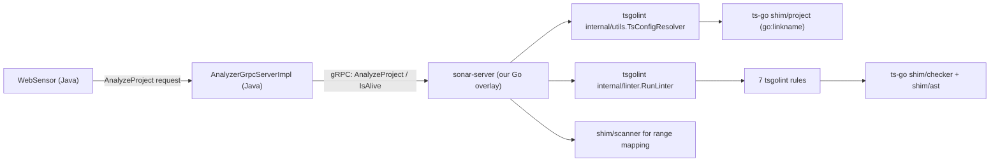
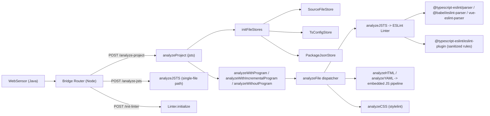

# TSGolint / TypeScript-Go API Surface Used by SonarJS

This document maps the concrete API surface used by the current SonarJS tsgolint gRPC PoC branch.

Scope:

- Sonar-owned Go overlay (`sonar-plugin/bridge/src/main/go/sonar-server/*`)
- Java gRPC caller and proto contract
- The 7 enabled tsgolint rules in this PoC
- Patch-coupled shim/project APIs used by tsconfig resolution

## 1. Runtime Schema



## 2. gRPC Endpoints We Use

Contract in [analyzer.proto](../sonar-plugin/bridge/src/main/proto/analyzer.proto):

- `AnalyzerService.AnalyzeProject` ([line 26](../sonar-plugin/bridge/src/main/proto/analyzer.proto#L26))
- `AnalyzerService.IsAlive` ([line 27](../sonar-plugin/bridge/src/main/proto/analyzer.proto#L27))

Java caller in [AnalyzerGrpcServerImpl.java](../sonar-plugin/bridge/src/main/java/org/sonar/plugins/javascript/bridge/grpc/AnalyzerGrpcServerImpl.java):

- `.analyzeProject(request)` ([line 124](../sonar-plugin/bridge/src/main/java/org/sonar/plugins/javascript/bridge/grpc/AnalyzerGrpcServerImpl.java#L124))
- `.isAlive(...)` ([line 149](../sonar-plugin/bridge/src/main/java/org/sonar/plugins/javascript/bridge/grpc/AnalyzerGrpcServerImpl.java#L149))

Request building in [WebSensor.java](../sonar-plugin/sonar-javascript-plugin/src/main/java/org/sonar/plugins/javascript/analysis/WebSensor.java):

- `base_dir`, `file_paths`, `rules`, `tsconfig_paths` are set ([lines 266-273](../sonar-plugin/sonar-javascript-plugin/src/main/java/org/sonar/plugins/javascript/analysis/WebSensor.java#L266))

Current Go server consumption in [service.go](../sonar-plugin/bridge/src/main/go/sonar-server/service.go):

- Uses `req.BaseDir`, `req.FilePaths`, `req.Rules`
- Does **not** currently consume `req.TsconfigPaths` or `req.Configuration`

## 3. Direct Calls From Our Go Overlay

Overlay files:

- [main.go](../sonar-plugin/bridge/src/main/go/sonar-server/main.go)
- [service.go](../sonar-plugin/bridge/src/main/go/sonar-server/service.go)
- [converter.go](../sonar-plugin/bridge/src/main/go/sonar-server/converter.go)
- [rules.go](../sonar-plugin/bridge/src/main/go/sonar-server/rules.go)

These files are copied into `tsgolint/cmd/sonar-server` during build and are currently byte-identical.

### 3.1 TSGolint APIs used directly

This is the core replacement boundary for typed-rule execution: in this PoC, `tsgolint` is not only replacing `@typescript-eslint` rules, it is also replacing the ESLint rule-execution runtime for the migrated typed rules.

| API                                                                                                                                   | What it does in our flow                                                | Why we use it                                                                                                 |
| ------------------------------------------------------------------------------------------------------------------------------------- | ----------------------------------------------------------------------- | ------------------------------------------------------------------------------------------------------------- |
| `utils.NewTsConfigResolver` ([service.go:39](../sonar-plugin/bridge/src/main/go/sonar-server/service.go#L39))                         | Builds a resolver bound to the request base dir and VFS.                | We need deterministic file-to-tsconfig grouping before lint execution.                                        |
| `TsConfigResolver.FindTsConfigParallel` ([service.go:53](../sonar-plugin/bridge/src/main/go/sonar-server/service.go#L53))             | Resolves tsconfig per file in parallel.                                 | This creates the workload (`Programs` and `UnmatchedFiles`) consumed by `RunLinter`.                          |
| `linter.RunLinter` ([service.go:75](../sonar-plugin/bridge/src/main/go/sonar-server/service.go#L75))                                  | Executes the tsgolint rule engine over ts-go programs and source files. | This is the main typed-analysis execution engine in Go (the role ESLint runtime has in Node for typed rules). |
| `rule.Rule` / `rule.RuleContext` callback wiring ([service.go:82-89](../sonar-plugin/bridge/src/main/go/sonar-server/service.go#L82)) | Adapts enabled rule list into executable listeners/callbacks.           | Lets Sonar enable only requested rules per analysis request, like quality-profile filtering.                  |

Enabled rule entry points from [rules.go](../sonar-plugin/bridge/src/main/go/sonar-server/rules.go):

- `await_thenable.AwaitThenableRule`
- `prefer_readonly.PreferReadonlyRule`
- `no_unnecessary_type_arguments.NoUnnecessaryTypeArgumentsRule`
- `no_unnecessary_type_assertion.NoUnnecessaryTypeAssertionRule`
- `prefer_return_this_type.PreferReturnThisTypeRule`
- `no_mixed_enums.NoMixedEnumsRule`
- `prefer_promise_reject_errors.PreferPromiseRejectErrorsRule`

Why this matters:

- In Node, typed rules run through ESLint + parser services.
- In this Go path, typed rules run through `tsgolint`'s own walker/listener model.
- So `tsgolint` is replacing both `@typescript-eslint` typed-rule logic and the ESLint execution layer for migrated typed rules.

### 3.2 TypeScript-Go shim APIs used directly by our overlay

These shims are infrastructure calls needed to construct/normalize the analysis environment and convert diagnostics back to Sonar ranges.

| API                                                                                                                               | What it does in our flow                                    | Why we use it                                                        |
| --------------------------------------------------------------------------------------------------------------------------------- | ----------------------------------------------------------- | -------------------------------------------------------------------- |
| `osvfs.FS` ([service.go:38](../sonar-plugin/bridge/src/main/go/sonar-server/service.go#L38))                                      | Gives access to the host file system.                       | Baseline file access for tsconfig and source resolution.             |
| `cachedvfs.From` ([service.go:38](../sonar-plugin/bridge/src/main/go/sonar-server/service.go#L38))                                | Wraps FS with caching.                                      | Reduces repeated IO during tsconfig/program construction.            |
| `bundled.WrapFS` ([service.go:38](../sonar-plugin/bridge/src/main/go/sonar-server/service.go#L38))                                | Adds bundled TypeScript libs over the FS abstraction.       | Ensures lib files are available to the compiler/checker environment. |
| `tspath.NormalizeSlashes` ([service.go:44](../sonar-plugin/bridge/src/main/go/sonar-server/service.go#L44))                       | Normalizes path separators before resolver/linter use.      | Avoids path mismatch issues across OS/path styles.                   |
| `scanner.GetECMALineAndCharacterOfPosition` ([converter.go:14](../sonar-plugin/bridge/src/main/go/sonar-server/converter.go#L14)) | Converts ts-go positions into ECMA line/column coordinates. | Required to map rule diagnostics into Sonar issue locations.         |

## 4. Do We Use TypeScript-Go Directly?

Yes, through shim packages.

What we do:

- Import `github.com/microsoft/typescript-go/shim/*` from our Go overlay.

What we do not do:

- We do not import `github.com/microsoft/typescript-go/internal/*` directly in our overlay.

Important coupling detail:

- Shim functions are `go:linkname` bindings into `typescript-go/internal/*`, for example:
  - [shim/scanner/shim.go:32-33](../tsgolint/shim/scanner/shim.go#L32)
  - [shim/tspath/shim.go:127-128](../tsgolint/shim/tspath/shim.go#L127)
  - [shim/vfs/cachedvfs/shim.go:11-12](../tsgolint/shim/vfs/cachedvfs/shim.go#L11)
  - [shim/vfs/osvfs/shim.go:10-11](../tsgolint/shim/vfs/osvfs/shim.go#L10)
  - [shim/bundled/shim.go:18-19](../tsgolint/shim/bundled/shim.go#L18)

## 5. Transitive Checker API Surface Used by the 7 PoC Rules

Across the 7 enabled rules, these `shim/checker` symbols are used:

- `Checker.GetTypeAtLocation`
- `Checker.GetSymbolAtLocation`
- `Checker.TypeToString`
- `Checker.ResolveName`
- `Checker.ResolveAlias`
- `Checker.GetCallSignatures`
- `Checker.GetReturnTypeOfSignature`
- `checker.Checker_getResolvedSignature`
- `checker.Checker_getTypeOfSymbol`
- `checker.Checker_getTypeFromTypeNode`
- `checker.Checker_getDeclaredTypeOfSymbol`
- `checker.Checker_getBaseTypes`
- `checker.Checker_getAccessedPropertyName`
- `checker.Checker_isTypeIdenticalTo`
- `checker.InterfaceType_thisType`
- `checker.Signature_declaration`
- `checker.SkipAlias`
- `checker.Type_flags`
- `checker.Type_symbol`
- `checker.Type_objectFlags`
- `checker.TypeFlags*` constants used by rule logic

Rule callsites:

- [await_thenable.go](../tsgolint/internal/rules/await_thenable/await_thenable.go)
- [prefer_readonly.go](../tsgolint/internal/rules/prefer_readonly/prefer_readonly.go)
- [no_unnecessary_type_arguments.go](../tsgolint/internal/rules/no_unnecessary_type_arguments/no_unnecessary_type_arguments.go)
- [no_unnecessary_type_assertion.go](../tsgolint/internal/rules/no_unnecessary_type_assertion/no_unnecessary_type_assertion.go)
- [prefer_return_this_type.go](../tsgolint/internal/rules/prefer_return_this_type/prefer_return_this_type.go)
- [no_mixed_enums.go](../tsgolint/internal/rules/no_mixed_enums/no_mixed_enums.go)
- [prefer_promise_reject_errors.go](../tsgolint/internal/rules/prefer_promise_reject_errors/prefer_promise_reject_errors.go)

Corresponding shim exports in:

- [shim/checker/shim.go](../tsgolint/shim/checker/shim.go)

## 6. Patch-Coupled APIs We Depend On

Our tsconfig resolution path depends on project/snapshot builder APIs exposed via patching.

Usage in tsgolint utility:

- [find_tsconfig.go:28-29](../tsgolint/internal/utils/find_tsconfig.go#L28): `project.NewConfigFileRegistryBuilder(project.TsGoLintNewSnapshotFSBuilder(...))`
- [find_tsconfig.go:94-95](../tsgolint/internal/utils/find_tsconfig.go#L94): `FindOrAcquireConfigForFile(..., ProjectLoadKindCreate, ...)`
- [find_tsconfig.go:38](../tsgolint/internal/utils/find_tsconfig.go#L38): `ComputeConfigFileName`
- [find_tsconfig.go:184](../tsgolint/internal/utils/find_tsconfig.go#L184): `GetAncestorConfigFileName`

Shim bridge points:

- [shim/project/shim.go:26-31](../tsgolint/shim/project/shim.go#L26)
- [shim/project/shim.go:53-54](../tsgolint/shim/project/shim.go#L53)
- [shim/project/shim.go:89-90](../tsgolint/shim/project/shim.go#L89)
- [shim/project/shim.go:105-106](../tsgolint/shim/project/shim.go#L105)

Related patch introducing exported/bridgeable symbols:

- [0003-patch-expose-more-functions-via-the-shim-with-type-f.patch](../tsgolint/patches/0003-patch-expose-more-functions-via-the-shim-with-type-f.patch)

Additional patch exposing checker accessors used by other tsgolint rules:

- [0005-feat-checker-add-IndexInfo-accessor-methods-for-shim.patch](../tsgolint/patches/0005-feat-checker-add-IndexInfo-accessor-methods-for-shim.patch)

## 7. What Should Ideally Be Public API

### 7.1 From tsgolint (library-facing, stable)

Prefer stable non-`internal` packages for:

- Program/tsconfig resolution service
- Lint execution entrypoint (`RunLinter` equivalent)
- Rule registration/execution contracts
- Diagnostic model and range conversion helpers

This would remove SonarJS reliance on `internal/*` and reduce break risk.

### 7.2 From typescript-go (stable external API)

Prefer official exported APIs for:

- Project/config resolution primitives currently reached through `ConfigFileRegistryBuilder*` and snapshot builder wiring
- Checker query methods heavily used by rules (resolved signatures, symbol/type queries, assignability/identity checks, base types)
- Position mapping helper currently accessed via scanner shim

This would remove `go:linkname` coupling to `internal/*` details and reduce upgrade fragility.

## 8. Practical Conclusion

Current state is a layered dependency:

- SonarJS overlay -> tsgolint internals
- SonarJS overlay -> ts-go shims
- ts-go shims -> ts-go internals (`go:linkname`)

So the PoC is not "tsgolint-only": it relies on both tsgolint internals and typescript-go internals (indirectly via shims), with additional coupling to Sonar-applied patches.

Replacement boundary for typed rules in this PoC:

- Node path: TypeScript compiler + `@typescript-eslint` parser/plugin + ESLint runtime.
- Go path: `tsgolint` rule engine + ts-go checker/shim stack.

So for the migrated typed-rule subset, `tsgolint` is replacing both `@typescript-eslint` rule execution and the ESLint runtime layer, not only the parser services side.

## 9. Node.js API Surface (TypeScript + typescript-eslint)

This section mirrors the Go mapping, but for the current Node.js analysis pipeline.

### 9.1 Runtime Schema



### 9.2 Bridge Endpoints Used in Node Path

Router endpoints in [router.ts](../packages/bridge/src/router.ts):

- `/analyze-project` ([line 51](../packages/bridge/src/router.ts#L51))
- `/cancel-analysis` ([line 52](../packages/bridge/src/router.ts#L52))
- `/analyze-jsts` ([line 53](../packages/bridge/src/router.ts#L53))
- `/init-linter` ([line 54](../packages/bridge/src/router.ts#L54))

Worker message types in [request.ts](../packages/bridge/src/request.ts):

- `on-analyze-jsts` ([line 50](../packages/bridge/src/request.ts#L50))
- `on-analyze-project` ([line 55](../packages/bridge/src/request.ts#L55))
- `on-cancel-analysis` ([line 60](../packages/bridge/src/request.ts#L60))
- `on-init-linter` ([line 64](../packages/bridge/src/request.ts#L64))
- `WsIncrementalResult` streaming shape ([line 39](../packages/bridge/src/request.ts#L39))

### 9.3 Direct APIs Used From `typescript` (JS version)

Current Node path uses `typescript` directly (not via tsgolint):

- `ts.createProgram` via `createStandardProgram` ([factory.ts:90](../packages/jsts/src/program/factory.ts#L90))
- `ts.createSemanticDiagnosticsBuilderProgram` ([factory.ts:34](../packages/jsts/src/program/factory.ts#L34))
- `ts.createCompilerHost` and host overrides ([factory.ts:118](../packages/jsts/src/program/factory.ts#L118))
- `ts.createSourceFile` for single-file parse path and incremental host ([factory.ts:112](../packages/jsts/src/program/factory.ts#L112), [compilerHost.ts:209](../packages/jsts/src/program/compilerHost.ts#L209))
- `ts.readConfigFile` + `ts.parseJsonConfigFileContent` ([options.ts:194](../packages/jsts/src/program/tsconfig/options.ts#L194), [options.ts:201](../packages/jsts/src/program/tsconfig/options.ts#L201))
- `ts.convertCompilerOptionsFromJson` ([options.ts:112](../packages/jsts/src/program/tsconfig/options.ts#L112))
- `ts.sys.readDirectory/fileExists/readFile` in filesystem mode ([options.ts:79](../packages/jsts/src/program/tsconfig/options.ts#L79), [options.ts:86](../packages/jsts/src/program/tsconfig/options.ts#L86), [options.ts:93](../packages/jsts/src/program/tsconfig/options.ts#L93))

### 9.4 Direct APIs Used From `typescript-eslint` (+ Babel/Vue)

Parser layer:

- Parser map binds `@typescript-eslint/parser`, `@babel/eslint-parser`, `vue-eslint-parser` ([eslint.ts:17-25](../packages/jsts/src/parsers/eslint.ts#L17))
- Uses parser `parseForESLint` and wires `parserServices` into ESLint `SourceCode` ([parse.ts:36-44](../packages/jsts/src/parsers/parse.ts#L36))
- Parser options set:
  - `disallowAutomaticSingleRunInference: true` ([options.ts:51](../packages/jsts/src/parsers/options.ts#L51))
  - `extraFileExtensions: ['.vue']` ([options.ts:59](../packages/jsts/src/parsers/options.ts#L59))

Program/type-aware parser integration:

- Node passes TypeScript programs directly to parser: `options.programs = [input.program]` and `options.project = input.tsConfigs` ([build.ts:45-46](../packages/jsts/src/builders/build.ts#L45))
- Fallback parse chain for resilience:
  - TypeScript parser first
  - Babel as module
  - Babel as script ([build.ts:33-89](../packages/jsts/src/builders/build.ts#L33))

Rule layer:

- Loads `@typescript-eslint/eslint-plugin` and sanitizes rules ([index.ts:18](../packages/jsts/src/rules/external/typescript-eslint/index.ts#L18))
- Sanitizer bypasses rules that require type-checking when parser services are absent ([sanitize.ts:48-49](../packages/jsts/src/rules/external/typescript-eslint/sanitize.ts#L48))

### 9.5 Node Project Discovery / Stores / Dependency Model

Project orchestration:

- `analyzeProject` chooses typed/incremental/no-program paths and initializes both JS/TS and CSS linters ([analyzeProject.ts:59-134](../packages/jsts/src/analysis/projectAnalysis/analyzeProject.ts#L59))

Tree walk and non-filesystem mode:

- `initFileStores` walks filesystem with `findFiles` when available, or simulates directory traversal from provided input files ([file-stores/index.ts:30-68](../packages/jsts/src/analysis/projectAnalysis/file-stores/index.ts#L30))
- Filesystem traversal utility: [find-files.ts:23-40](../packages/shared/src/helpers/find-files.ts#L23)

Source file store:

- Holds analyzable files and content; keeps ignored directories and O(1) directory index ([source-files.ts:37-114](../packages/jsts/src/analysis/projectAnalysis/file-stores/source-files.ts#L37))
- `getFilesInDirectory` feeds non-filesystem `tsconfig` parse host mode ([source-files.ts:70](../packages/jsts/src/analysis/projectAnalysis/file-stores/source-files.ts#L70), [options.ts:82](../packages/jsts/src/program/tsconfig/options.ts#L82))

TSConfig store:

- Supports lookup mode and explicit `sonar.typescript.tsconfigPaths` mode ([tsconfigs.ts:51-57](../packages/jsts/src/analysis/projectAnalysis/file-stores/tsconfigs.ts#L51))
- Adds discovered project references at runtime (`addDiscoveredTsConfig`) ([tsconfigs.ts:68](../packages/jsts/src/analysis/projectAnalysis/file-stores/tsconfigs.ts#L68))
- Invalidates caches on baseDir/config/fs changes and clears program-related caches ([tsconfigs.ts:79-112](../packages/jsts/src/analysis/projectAnalysis/file-stores/tsconfigs.ts#L79))

Package/dependency store:

- Reads `package.json` files, tracks parent dir chain, and pre-fills closest/all-parent manifest caches ([package-jsons.ts:35-107](../packages/jsts/src/analysis/projectAnalysis/file-stores/package-jsons.ts#L35))
- Dependency extraction includes `dependencies`, `devDependencies`, `peerDependencies`, `optionalDependencies`, `_moduleAliases`, and `workspaces` globs ([parse.ts:34-57](../packages/jsts/src/rules/helpers/package-jsons/parse.ts#L34))
- Rule activation is dependency-aware (`requiredDependency` in rule metadata) through `getDependencies(...)` ([linter.ts:262-277](../packages/jsts/src/linter/linter.ts#L262), [dependencies.ts:54](../packages/jsts/src/rules/helpers/package-jsons/dependencies.ts#L54))

### 9.6 Program Lifecycle, Caching, Orphans

SonarQube path (`analyzeWithProgram`):

- Iterates all known tsconfigs, creates TypeScript programs, discovers refs, and analyzes files per program ([analyzeWithProgram.ts:55-236](../packages/jsts/src/analysis/projectAnalysis/analyzeWithProgram.ts#L55))
- Optional orphan handling: `createTSProgramForOrphanFiles` -> merged/default compiler options entrypoint program ([analyzeWithProgram.ts:100-162](../packages/jsts/src/analysis/projectAnalysis/analyzeWithProgram.ts#L100))
- Clears program/source caches at end of single-run SonarQube analysis ([analyzeWithProgram.ts:124-129](../packages/jsts/src/analysis/projectAnalysis/analyzeWithProgram.ts#L124))

SonarLint path (`analyzeWithIncrementalProgram`):

- Uses cached builder programs via `createOrGetCachedProgramForFile` ([analyzeWithIncrementalProgram.ts:77](../packages/jsts/src/analysis/projectAnalysis/analyzeWithIncrementalProgram.ts#L77))
- Finds best tsconfig match by path specificity; resolves refs; fallback default options for orphan files if enabled ([analyzeWithIncrementalProgram.ts:114-175](../packages/jsts/src/analysis/projectAnalysis/analyzeWithIncrementalProgram.ts#L114))

Compiler/program caches:

- Incremental compiler host tracks file versions, lazy content reads, parsed source-file cache, and invalidation ([compilerHost.ts:41-244](../packages/jsts/src/program/compilerHost.ts#L41))
- Program cache manager uses LRU metadata + WeakMap-held programs/hosts ([programCache.ts:41-190](../packages/jsts/src/program/cache/programCache.ts#L41))

No-program fallback:

- JS/TS files not in any tsconfig are explicitly analyzed without type information ([analyzeWithoutProgram.ts:38-55](../packages/jsts/src/analysis/projectAnalysis/analyzeWithoutProgram.ts#L38))

## 10. Node vs Go Comparison (Current State)

| Capability                   | Node.js (current)                                                                                                                                                                                                                                                                                                                                                          | Go + tsgolint PoC (current)                                                                                                                                                                                                           | Parity/Gaps                                                                                                                                            |
| ---------------------------- | -------------------------------------------------------------------------------------------------------------------------------------------------------------------------------------------------------------------------------------------------------------------------------------------------------------------------------------------------------------------------- | ------------------------------------------------------------------------------------------------------------------------------------------------------------------------------------------------------------------------------------- | ------------------------------------------------------------------------------------------------------------------------------------------------------ |
| External analysis API        | HTTP bridge endpoints: `/analyze-project`, `/analyze-jsts`, `/init-linter`, `/cancel-analysis` ([router.ts](../packages/bridge/src/router.ts))                                                                                                                                                                                                                             | gRPC only: `AnalyzeProject`, `IsAlive` ([analyzer.proto](../sonar-plugin/bridge/src/main/proto/analyzer.proto), [service.go](../sonar-plugin/bridge/src/main/go/sonar-server/service.go#L31))                                         | Different control-plane granularity.                                                                                                                   |
| Typed rule execution engine  | ESLint `Linter.verify` executes rules over `SourceCode` ([linter.ts:216](../packages/jsts/src/linter/linter.ts#L216)) with parser services wired from the parser layer ([parse.ts:36-44](../packages/jsts/src/parsers/parse.ts#L36))                                                                                                                                       | `tsgolint` `linter.RunLinter` executes listener-based rules over ts-go AST/checker contexts ([service.go:75](../sonar-plugin/bridge/src/main/go/sonar-server/service.go#L75), [linter.go](../tsgolint/internal/linter/linter.go#L43)) | For migrated typed rules, Go replaces both `@typescript-eslint` and the ESLint execution runtime; parity gaps remain for the broader ESLint ecosystem. |
| TS engine integration        | Direct `typescript` API usage (`createProgram`, builder program, tsconfig parse APIs) ([factory.ts](../packages/jsts/src/program/factory.ts), [options.ts](../packages/jsts/src/program/tsconfig/options.ts))                                                                                                                                                              | Overlay calls tsgolint internals + ts-go shim packages ([service.go](../sonar-plugin/bridge/src/main/go/sonar-server/service.go#L39), section 3/4 above)                                                                              | Node is direct JS ecosystem API; Go is transitive via shim/internal coupling.                                                                          |
| tsconfig discovery           | Filesystem/project walk + explicit `tsconfigPaths` + dynamic discovered references ([file-stores/index.ts](../packages/jsts/src/analysis/projectAnalysis/file-stores/index.ts), [tsconfigs.ts](../packages/jsts/src/analysis/projectAnalysis/file-stores/tsconfigs.ts), [analyzeWithProgram.ts](../packages/jsts/src/analysis/projectAnalysis/analyzeWithProgram.ts#L225)) | Resolver per file: `FindTsConfigParallel`; `req.TsconfigPaths` currently not consumed by overlay ([service.go:53](../sonar-plugin/bridge/src/main/go/sonar-server/service.go#L53), section 2 above)                                   | Explicit user-provided tsconfig path semantics are missing on Go side.                                                                                 |
| Orphan/unmatched files       | Configurable: create orphan TS program or analyze without type-checking ([analyzeWithProgram.ts:100](../packages/jsts/src/analysis/projectAnalysis/analyzeWithProgram.ts#L100), [analyzeWithoutProgram.ts](../packages/jsts/src/analysis/projectAnalysis/analyzeWithoutProgram.ts#L38))                                                                                    | Unmatched files are passed to `CreateInferredProjectProgram` inside tsgolint linter ([linter.go:125-138](../tsgolint/internal/linter/linter.go#L125))                                                                                 | Behavioral divergence: Node has explicit typed-vs-untyped fallback mode switch.                                                                        |
| Incremental/editor path      | SonarLint incremental caches (`createOrGetCachedProgramForFile`, versioned host, LRU cache) ([analyzeWithIncrementalProgram.ts](../packages/jsts/src/analysis/projectAnalysis/analyzeWithIncrementalProgram.ts), [compilerHost.ts](../packages/jsts/src/program/compilerHost.ts), [programCache.ts](../packages/jsts/src/program/cache/programCache.ts))                   | Current Go server path is single-run per request (`RunLinter`) ([service.go:75](../sonar-plugin/bridge/src/main/go/sonar-server/service.go#L75))                                                                                      | No 1-to-1 incremental model in current Go overlay path.                                                                                                |
| Dependency-aware rule gating | Uses package.json graph and `requiredDependency` filtering ([package-jsons.ts](../packages/jsts/src/analysis/projectAnalysis/file-stores/package-jsons.ts), [linter.ts:262](../packages/jsts/src/linter/linter.ts#L262))                                                                                                                                                   | No equivalent dependency-based enable/disable in overlay                                                                                                                                                                              | Can produce different active rule set.                                                                                                                 |
| Parser fallback strategy     | TS parser -> Babel module -> Babel script; Vue parser integration ([build.ts](../packages/jsts/src/builders/build.ts), [eslint.ts](../packages/jsts/src/parsers/eslint.ts))                                                                                                                                                                                                | No Babel/Vue parser path in Go PoC                                                                                                                                                                                                    | Non-standard JS and Vue parsing behavior differs.                                                                                                      |
| Embedded/non-TS analysis     | HTML/YAML embedded JS + CSS/stylelint + Vue template-specific handling in Node ([analyzeFile.ts](../packages/jsts/src/analysis/projectAnalysis/analyzeFile.ts), [packages/html](../packages/html/src/index.ts), [packages/yaml](../packages/yaml/src/index.ts), [css wrapper](../packages/css/src/linter/wrapper.ts), [S6299](../packages/jsts/src/rules/S6299/rule.ts))   | Out of scope in current Go effort                                                                                                                                                                                                     | Must remain Node-owned for now.                                                                                                                        |

## 11. 1:1 Migration Gaps For Future Go Implementation

If the target is real 1-to-1 behavior with current Node project analysis, Go side is missing at least:

1. A first-class tsconfig discovery model equivalent to Node:
   - lookup + explicit `tsconfigPaths` pattern mode
   - deterministic ordering
   - dynamic discovered reference injection during traversal
2. A project file-store layer equivalent to Node:
   - source-file store with ignored-dir propagation and directory index
   - package.json store with parent-chain cache prefill
   - filesystem traversal fallback simulation when direct FS access is unavailable
3. Dependency-aware rule activation parity:
   - consume package manifests and gate rules by required dependencies
4. Explicit orphan policy parity:
   - configurable "create inferred program for orphan files" vs "analyze without type-checking"
   - warnings/messages matching Node semantics
5. Incremental SonarLint parity:
   - cache keying by files-in-program
   - versioned incremental compiler host + parsed SourceFile cache invalidation
6. Parser fallback parity:
   - module/script Babel fallback path and Vue parser integration where relevant
7. Stable public API surface from upstreams:
   - today, Go path still depends on tsgolint internals and ts-go shim/internal contracts (sections 3-6 above)

## 12. Out-of-Scope Paths Remaining in Node (Explicit)

For this effort, these analysis domains remain Node-owned and are not moving to Go soon:

- CSS analysis (stylelint pipeline), including CSS extracted from Vue/web files ([analyzeFile.ts:97-109](../packages/jsts/src/analysis/projectAnalysis/analyzeFile.ts#L97), [wrapper.ts](../packages/css/src/linter/wrapper.ts))
- Embedded JavaScript analysis in HTML and YAML ([analyzeFile.ts:170-183](../packages/jsts/src/analysis/projectAnalysis/analyzeFile.ts#L170), [html index](../packages/html/src/index.ts), [yaml index](../packages/yaml/src/index.ts))
- Vue-specific parsing/template semantics (`vue-eslint-parser` services like `defineTemplateBodyVisitor`, `getDocumentFragment`) ([S6299](../packages/jsts/src/rules/S6299/rule.ts#L47), [vue helper](../packages/jsts/src/rules/helpers/vue.ts#L31))
- Non-typechecked fallback analysis of JS/TS files not in tsconfig ([analyzeWithoutProgram.ts](../packages/jsts/src/analysis/projectAnalysis/analyzeWithoutProgram.ts#L38))

So even with a Go expansion for typed TS analysis, the architecture remains hybrid for the foreseeable roadmap: Node continues to own non-typechecked, embedded, CSS, and Vue-specialized analysis.

## 13. ESLint to tsgolint Rule Authoring Quickstart

This section gives a practical mental model for implementing typed rules in `tsgolint` when you are used to ESLint + ESTree + esquery.

### 13.1 Core Model Mapping

| ESLint (Node)                                    | tsgolint (Go)                                                                                                                                                                                                                                                                      |
| ------------------------------------------------ | ---------------------------------------------------------------------------------------------------------------------------------------------------------------------------------------------------------------------------------------------------------------------------------- |
| `create(context)`                                | `Run(ctx rule.RuleContext, options any)` in [`internal/rule/rule.go`](../tsgolint/internal/rule/rule.go)                                                                                                                                                                        |
| visitor key: `"CallExpression"`                  | listener key: `ast.KindCallExpression` in `rule.RuleListeners`                                                                                                                                                                                                                    |
| visitor key: `"CallExpression:exit"`             | `rule.ListenerOnExit(ast.KindCallExpression)` (example pattern in [`prefer_readonly.go`](../tsgolint/internal/rules/prefer_readonly/prefer_readonly.go))                                                                                                                       |
| selector string (`esquery`)                      | no generic selector DSL; use `ast.Kind` listeners + imperative checks inside callbacks                                                                                                                                                                                            |
| `context.report(...)`                            | `ctx.ReportNode`, `ctx.ReportRange`, `ctx.ReportNodeWithFixes`, `ctx.ReportNodeWithSuggestions` in [`internal/rule/rule.go`](../tsgolint/internal/rule/rule.go)                                                                                                                |
| parser services + TS checker                     | direct `ctx.Program` and `ctx.TypeChecker` (same `RuleContext`)                                                                                                                                                                                                                   |
| autofix via fixer API                            | `rule.RuleFix*` helpers (`RuleFixInsertBefore`, `RuleFixReplace`, `RuleFixRemoveRange`, etc.) in [`internal/rule/rule.go`](../tsgolint/internal/rule/rule.go)                                                                                                                 |

In short: tsgolint keeps the rule-authoring shape familiar (listeners + context + report/fix), but operates on TypeScript-go AST nodes directly instead of ESTree nodes selected through esquery.

### 13.2 "Selector Equivalents" in Practice

For selector-like behavior:

1. Register the narrowest `ast.Kind...` listener you can.
2. Add guard conditions in code (`ast.IsX(...)`, property/name checks, type checks).
3. Use `ListenerOnExit(...)` where ESLint used `:exit`.
4. Use `ListenerOnAllowPattern(...)` / `ListenerOnNotAllowPattern(...)` only for rules that depend on the assignment-pattern semantics implemented in the linter walker (see traversal notes in [`internal/linter/linter.go`](../tsgolint/internal/linter/linter.go)).

Examples:

- Direct node listener: [`await_thenable.go`](../tsgolint/internal/rules/await_thenable/await_thenable.go)
- Exit listener usage: [`dot_notation.go`](../tsgolint/internal/rules/dot_notation/dot_notation.go)
- Pattern-aware listeners: [`no_misused_spread.go`](../tsgolint/internal/rules/no_misused_spread/no_misused_spread.go), [`no_unsafe_assignment.go`](../tsgolint/internal/rules/no_unsafe_assignment/no_unsafe_assignment.go)

### 13.3 AST Navigation in tsgolint

Common navigation primitives:

- Node kind check: `node.Kind == ast.Kind...`
- Type guards: `ast.IsCallExpression(node)`, `ast.IsPropertyAccessExpression(node)`, etc. (from [`shim/ast/shim.go`](../tsgolint/shim/ast/shim.go))
- Accessors/casts: `node.AsCallExpression()`, `node.Expression()`, `node.Name()`, `node.Parent`
- Child traversal when needed: `node.ForEachChild(...)`
- Type-level analysis: `ctx.TypeChecker.GetTypeAtLocation(...)`, `ctx.TypeChecker.GetSymbolAtLocation(...)`, plus helpers in [`internal/utils/ts_api_utils.go`](../tsgolint/internal/utils/ts_api_utils.go)

### 13.4 Minimal Rule Skeleton

```go
package no_console_log

import (
  "github.com/microsoft/typescript-go/shim/ast"
  "github.com/typescript-eslint/tsgolint/internal/rule"
)

var NoConsoleLogRule = rule.Rule{
  Name: "no-console-log",
  Run: func(ctx rule.RuleContext, options any) rule.RuleListeners {
    return rule.RuleListeners{
      ast.KindCallExpression: func(node *ast.Node) {
        callee := node.Expression()
        if !ast.IsPropertyAccessExpression(callee) {
          return
        }
        p := callee.AsPropertyAccessExpression()
        if ast.IsIdentifier(p.Expression) &&
          p.Expression.AsIdentifier().Text == "console" &&
          p.Name().Text() == "log" {
          ctx.ReportNode(callee, rule.RuleMessage{
            Id:          "avoidConsoleLog",
            Description: "Avoid console.log",
          })
        }
      },
    }
  },
}
```

### 13.5 Step-by-Step in This Repository

1. Create rule package under `tsgolint/internal/rules/<rule_name>/`.
2. Add `<rule_name>.go` with a `rule.Rule` implementation.
3. Add `<rule_name>_test.go` using [`rule_tester.RunRuleTester`](../tsgolint/internal/rule_tester/rule_tester.go).
4. Register rule in tsgolint CLI/headless registry in [`tsgolint/cmd/tsgolint/main.go`](../tsgolint/cmd/tsgolint/main.go).
5. If rule has options:
   - add `schema.json` in the rule directory
   - run `node tools/gen-json-schemas.mjs`
   - parse options with `utils.UnmarshalOptions[...]` (usage pattern in [`prefer_readonly.go`](../tsgolint/internal/rules/prefer_readonly/prefer_readonly.go))
6. Validate with:
   - `go test ./internal/rules/<rule_name>`
   - `go test ./internal/...`

### 13.6 SonarJS gRPC Offload Wiring (If Rule Should Run via Go Path)

Adding a rule to `tsgolint` alone is not enough for SonarJS gRPC offload.

You also need to wire mappings and enabled lists:

1. Add the rule to `allRules` in Go analyzer rule lists:
   - [`sonar-plugin/bridge/src/main/go/sonar-server/rules.go`](../sonar-plugin/bridge/src/main/go/sonar-server/rules.go)
   - mirrored copy: [`tsgolint/cmd/sonar-server/rules.go`](../tsgolint/cmd/sonar-server/rules.go)
2. Add Sonar-key <-> ESLint-name mapping on Java side:
   - offloaded set and forward map in [`JsTsChecks.java`](../sonar-plugin/sonar-javascript-plugin/src/main/java/org/sonar/plugins/javascript/analysis/JsTsChecks.java)
   - reverse conversion map in [`TsgolintIssueConverter.java`](../sonar-plugin/bridge/src/main/java/org/sonar/plugins/javascript/bridge/TsgolintIssueConverter.java)

Without those mappings, the rule either will not be requested by the scanner or returned diagnostics will not map back to Sonar rule keys.
