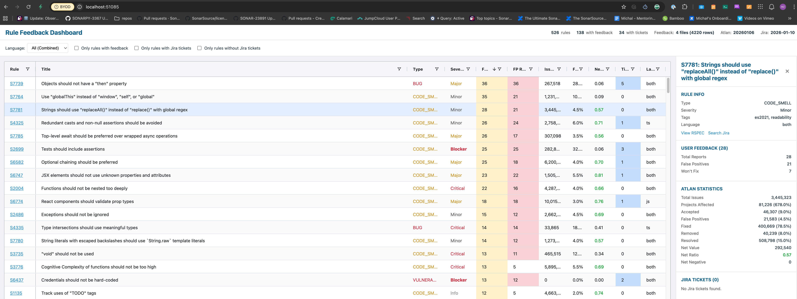

# Rule Feedback Dashboard

A local web dashboard for analyzing SonarJS/SonarTS rule feedback from multiple data sources. Helps prioritize rule improvements by aggregating user feedback, usage statistics, and Jira tickets.



## Features

- **Aggregated Data View**: Combines feedback from user exports, Atlan statistics, Jira tickets, and RSPEC metadata
- **Sortable/Filterable Table**: AG Grid with sorting, filtering, and column customization
- **Detail Panel**: Click any rule to see full stats, user comments with file locations, and external links
- **Multiple Filters**: Filter by language (JS/TS), Sonar Way, scope, quick fix status, feedback, and Jira tickets
- **Sonar Way Highlighting**: Rules in the Sonar Way quality profile are highlighted with green background
- **Fix with Claude**: Opens Claude Code in a terminal with full rule context for AI-assisted analysis
- **Status Bar**: Shows data freshness and summary statistics

## Prerequisites

Before using this dashboard, ensure you have the following tools configured:

### 1. GitHub CLI (`gh`)

Required for fetching Atlan statistics from the sonar-vibe-bot repository.

```bash
# Install (macOS)
brew install gh

# Authenticate
gh auth login
```

### 2. Atlassian CLI (`acli`)

Required for fetching Jira tickets from the JS project.

```bash
# Authenticate
acli jira auth
```

### 3. User Feedback Access

To export user feedback CSV files, you need access to the SonarCloud feedback data.

See: [Access SonarCloud User Feedback](https://xtranet-sonarsource.atlassian.net/wiki/spaces/PM/pages/2867724422/Access+SonarCloud+User+Feedback)

### 4. Claude Code CLI (Optional)

Required for the "Fix with Claude" feature that provides AI-assisted rule analysis.

```bash
# Install Claude Code CLI
# See: https://docs.anthropic.com/claude-code/installation
```

## Data Sources

### 1. User Feedback CSV

Export feedback data and place CSV files in:

```
tools/user-feedback/data/*.csv
```

**Required columns**: `ruleKey`, `ruleRepository`, `comment`, `resolution`, `feedbackDate`, `fileUrl`, `fileName`, `line`, `projectKey`, `issueUrl`

The dashboard loads **all CSV files** in this directory and combines them.

### 2. Atlan Statistics (from sonar-vibe-bot)

Fetched automatically via GitHub API from:

```
SonarSource/sonar-vibe-bot/jsts/issue-data/data/YYYYMMDD.csv
```

Run `npm run fetch-atlan` to download the latest data.

### 3. Jira Tickets

Fetched automatically from the JS Jira project using `acli`:

```bash
npm run fetch-jira
```

### 4. RSPEC Metadata

Automatically read from the local SonarJS repository:

```
sonar-plugin/javascript-checks/src/main/resources/org/sonar/l10n/javascript/rules/javascript/S*.json
```

## Installation

```bash
cd tools/rule-feedback-dashboard
npm install
```

## Usage

### Quick Start (with existing data)

If you already have feedback CSV files in `tools/user-feedback/data/`:

```bash
npm run build-data   # Process RSPEC + merge all data sources
npm run build        # Bundle TypeScript
npm run serve        # Start server at http://localhost:3000
```

### Full Data Refresh

```bash
# 1. Fetch latest Atlan stats from GitHub
npm run fetch-atlan

# 2. Fetch Jira tickets (requires acli auth)
npm run fetch-jira

# 3. Build combined dataset
npm run build-data

# 4. Build and serve
npm run build
npm run serve
```

### All-in-One (after data is fetched)

```bash
npm run dev  # Runs build-data + build + serve
```

## Data Storage

```
tools/rule-feedback-dashboard/
├── data/                    # Generated data (gitignored)
│   ├── rspec.json           # Processed RSPEC metadata
│   ├── atlan.json           # Fetched Atlan statistics
│   ├── jira.json            # Fetched Jira tickets
│   └── combined.json        # Final merged dataset
└── dist/                    # Build output (gitignored)
    ├── index.html
    ├── main.js
    └── data/combined.json
```

**Note**: The `data/` folder is gitignored because feedback CSVs may contain PII.

## Adding New Feedback Data

1. Follow the instructions at [Access SonarCloud User Feedback](https://xtranet-sonarsource.atlassian.net/wiki/spaces/PM/pages/2867724422/Access+SonarCloud+User+Feedback) to export feedback CSV
2. Place the CSV file in `tools/user-feedback/data/`
3. Run `npm run build-data` to rebuild the combined dataset
4. Run `npm run build` to update the served data

## Column Reference

| Column    | Description                                                         |
| --------- | ------------------------------------------------------------------- |
| Rule      | Rule key (e.g., S1234) with link to RSPEC                           |
| Title     | Rule title from RSPEC                                               |
| Severity  | Minor, Major, Critical, Blocker                                     |
| Feedback  | Total user feedback reports                                         |
| Issues    | Atlan: Total issues found across all projects                       |
| FP%       | Atlan: False positive percentage                                    |
| Net Ratio | Atlan: Net value ratio (positive = good)                            |
| Tickets   | Number of Jira tickets mentioning this rule                         |
| Lang      | js, ts, or both                                                     |
| Scope     | Main (production code), Tests, or All                               |
| QF        | Quick Fix availability: ✓=covered, ◐=targeted/partial, ✗=infeasible |

**Note**: Rows with green background are rules included in the Sonar Way quality profile.

## Detail Panel

Click any row to open the detail panel showing:

- **Rule Info**: Type, severity, tags, language, Sonar Way status, scope, quick fix
- **External Links**: RSPEC page, Jira search
- **Fix with Claude Button**: Opens Claude Code with full rule context
- **User Feedback Stats**: Total reports, FP count, Won't Fix count
- **Atlan Statistics**: All 17 metrics from issue data
- **Jira Tickets**: List with links to each ticket
- **Feedback Comments**: User comments with:
  - File name and line number
  - Project key
  - Link to original file (if available)
  - SonarCloud issue link

## Fix with Claude

The "Fix with Claude" button opens Claude Code in a new terminal window with comprehensive context about the rule:

- Rule metadata (key, title, type, severity, scope, tags)
- User feedback statistics and comments
- Atlan statistics (FP%, net ratio, issue counts)
- Existing Jira tickets
- RSPEC description (full HTML)
- Project root path for file navigation

Claude can then analyze the rule, propose improvements, and help create Jira tickets.

**Supported platforms**: macOS (Terminal), Windows (cmd.exe), Linux (gnome-terminal, xterm, konsole)

## Scripts Reference

| Script                  | Description                               |
| ----------------------- | ----------------------------------------- |
| `npm run fetch-atlan`   | Fetch latest Atlan CSV from GitHub        |
| `npm run fetch-jira`    | Fetch Jira tickets via acli               |
| `npm run process-rspec` | Process RSPEC JSON files                  |
| `npm run build-data`    | Merge all data sources into combined.json |
| `npm run build`         | Bundle TypeScript and copy data to dist   |
| `npm run serve`         | Start local server on port 3000           |
| `npm run dev`           | build-data + build + serve                |
